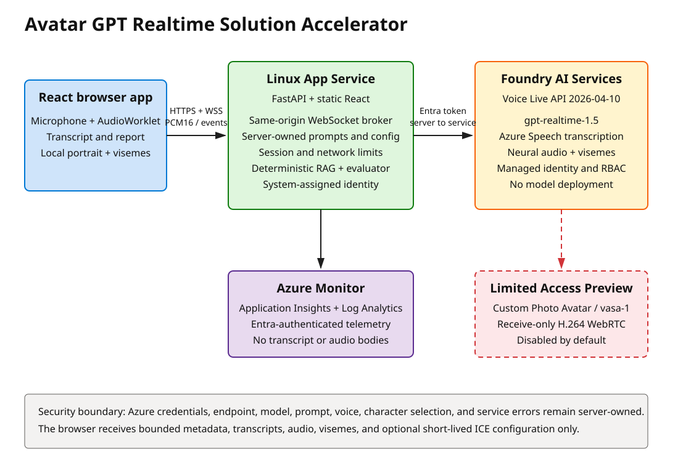

# Avatar GPT Realtime Solution Accelerator

[](https://github.com/jaypadhya1605/Avatar-GPT-Realtime-Solution-Accelerator/actions/workflows/ci.yml)
[](LICENSE)
[](https://www.python.org/)
[](https://react.dev/)

A reproducible voice-first training application for practicing empathetic conversations with synthetic patients. It combines Microsoft Foundry Voice Live, Azure Speech, a same-origin FastAPI broker, three distinct locally animated portraits, deterministic synthetic grounding, and evidence-based coaching.

> [!WARNING]
> This project is a synthetic training demonstration. It is not a medical device, clinical decision-support system, care-delivery channel, or system of record. Never enter protected health information, personally identifiable information, credentials, or real patient details.



## What it includes

- Three synthetic end-of-life communication scenarios focused on fear and pain, emotional exhaustion, and plain-language repair.
- Three matched synthetic patient portraits and voices, with easy, medium, and hard behavior. See [synthetic persona assets](assets/README.md).
- Twelve reference voice clips so you can hear every persona before deploying anything.
- Full-duplex 24 kHz PCM16 speech, Azure semantic VAD, deep noise suppression, server echo cancellation, and interruption.
- GA-default viseme events that animate the correct local portrait without requiring avatar approval.
- Scenario-isolated, hash-validated synthetic RAG with at most three packaged sources per turn.
- Deterministic coaching for emotion recognition, validation, clarity, shared decision-making, responsiveness, jargon, and interaction quality.
- Session limits, strict same-origin WebSockets, bounded protocol messages, generic client errors, security headers, and no browser credential.
- Keyless Azure access through App Service managed identity and resource-scoped RBAC.
- Optional Custom Photo Avatar using `vasa-1` and WebRTC, clearly isolated as a **Limited Access Preview**.
- `azd` plus Bicep deployment, locked dependencies, package manifests, CI, privacy scans, and clean teardown.

## GA default and Preview

| Capability | Default status | Deployment dependency |
| --- | --- | --- |
| Voice Live `gpt-realtime-1.5` | GA path | Foundry `AIServices` account; no model deployment |
| Azure Speech transcription and `gpt-realtime` voices | GA path | Included through Voice Live |
| Local portrait animation from visemes | GA path | Three packaged synthetic PNGs |
| Custom Photo Avatar with `vasa-1` | **Limited Access Preview**, off | Approval, a Foundry project, and three tenant-owned characters |

The accelerator is complete without Preview access. See [Custom Photo Avatar](docs/custom-photo-avatar.md) only after the GA path passes acceptance testing.

## Local quick start

Prerequisites: PowerShell 7, Python 3.12, Node.js 20 or newer, npm, and Git. On Windows, use a short checkout path because some Python wheels still fail in deeply nested directories.

```powershell
git clone https://github.com/jaypadhya1605/Avatar-GPT-Realtime-Solution-Accelerator.git
Set-Location Avatar-GPT-Realtime-Solution-Accelerator
./scripts/bootstrap.ps1
./scripts/run-mock.ps1
```

Open `http://localhost:8000`. Mock mode exercises the responsive SPA, scenario selection, deterministic evaluator, synthetic grounding, reports, and API contracts without Azure or billable audio. It intentionally does not synthesize fake realtime speech.

Run the complete local quality gate:

```powershell
./scripts/test.ps1
./scripts/package.ps1
```

## Deploy to Azure

Additional prerequisites: Azure CLI, Azure Developer CLI, an Azure subscription, permission to create the resources and three role assignments, and registered `Microsoft.CognitiveServices`, `Microsoft.Insights`, `Microsoft.OperationalInsights`, and `Microsoft.Web` providers.

```powershell
az login
az account set --subscription "<subscription-id>"
azd auth login
./scripts/preflight.ps1
azd env new dev
azd env set AZURE_LOCATION eastus2
azd env set AZURE_APP_SERVICE_LOCATION eastus2
azd provision --preview
azd up
```

`AZURE_LOCATION` selects the Foundry region. `AZURE_APP_SERVICE_LOCATION` may use a different region when subscription policy or Linux B1 worker quota requires it; keeping the regions close reduces realtime latency.

`azd up` creates one Linux Python 3.12 App Service, one Foundry `AIServices` account, Log Analytics, Application Insights, and the three least-scope role assignments. It does not create a Foundry project, model deployment, Storage account, Key Vault, registry, private network, or Custom Photo Avatar.

Verify the result:

```powershell
$uri = azd env get-value SERVICE_WEB_URI
Invoke-RestMethod "$uri/healthz"
Invoke-RestMethod "$uri/readyz"
Start-Process $uri
```

Read the [deployment guide](docs/deployment.md) before provisioning. Azure resources incur charges. No deployment is required to run tests or mock mode.

## How it works

The browser captures PCM16 audio with an AudioWorklet and sends it to `/api/voice-live` over the same origin. FastAPI validates the browser session, scenario, difficulty, origin, rate limits, and message bounds; retrieves only matching synthetic grounding; then opens Voice Live with managed identity. Azure returns transcript, audio, and viseme events. The browser schedules audio and portrait motion together, while a local deterministic evaluator creates the final coaching report.

The browser never receives or controls the Azure endpoint, model, prompt, voice, character, access token, or service error details. See the editable [Excalidraw architecture](docs/images/architecture/solution-architecture.excalidraw) and the full [architecture guide](docs/architecture.md).

## Documentation

- [Architecture](docs/architecture.md): runtime flow, trust boundaries, resources, and scaling assumptions.
- [Synthetic persona assets](assets/README.md): how the portraits and voices pair up, and the two voice families you can choose between.
- [Deployment](docs/deployment.md): prerequisites, `azd up`, verification, updates, and cleanup.
- [Custom Photo Avatar](docs/custom-photo-avatar.md): Limited Access, image and consent requirements, creation, mapping, validation, and rollback.
- [Security and privacy](docs/security-and-privacy.md): data inventory, identity, browser controls, persistence, telemetry, and limitations.
- [Operations](docs/operations.md): workshop checklist, health, logs, limits, releases, rollback, cost, and cleanup.
- [Testing](docs/testing.md): automated gates, mock mode, GA/Preview acceptance, and publication review.
- [Contributing](CONTRIBUTING.md), [support](SUPPORT.md), and [security reporting](SECURITY.md).

## Repository layout

```text
assets/        Synthetic persona reference: paired portrait and voice documentation, voice samples
backend/       FastAPI APIs, Voice Live bridge, RAG, evaluator, tests, locked Python dependencies
frontend/      React/TypeScript experience, AudioWorklet client, local avatar renderer, portrait PNGs, Vitest tests
data/          Versioned synthetic conversation corpus
infra/         Subscription- and resource-group-scope Bicep
scripts/       Bootstrap, lock, test, package, preflight, privacy, mock, and Preview helpers
docs/          Architecture, deployment, security, operations, testing, and Preview runbooks
```

Generated deployment packages are written to ignored `artifacts/app` with a SHA-256 manifest. Local environments, `.env` files, `azd` state, build output, consent media, and deployment-specific values must remain untracked.

## Responsible use

Use only synthetic role-play and approved fictional avatars. Make the synthetic nature of the experience clear to users, provide a feedback path, test for biased or inappropriate behavior, and conduct your own privacy, security, clinical safety, accessibility, legal, and responsible AI reviews before adapting the accelerator.

## License

Licensed under the [MIT License](LICENSE). Third-party services and Preview features remain subject to their own terms and access requirements.